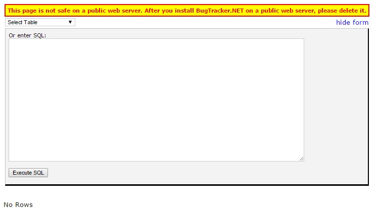
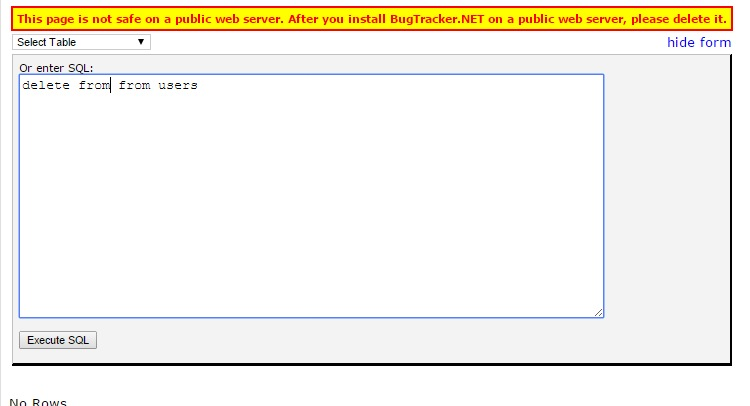
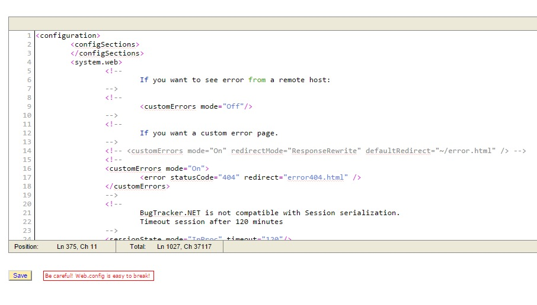

#Revealing Sensitive Data

The final security issue we're going to address is that of revealing sensitive data. This data can be revealed through a misapplication of a cryptographic mechanism such as SSL or by leaving unencrypted such things as database backups. We have, in recent months, seen a large number of SSL vulnerabilities that may be used to reveal data. BugTracker.NET does not explicitly require SSL and the implementation of SSL is left up to the end user.

Deploying SSL certificates was once a very expensive proposition. In fact the first version of the authentication protocol OAuth protocol was designed in a way that would maintain security without having to resort to using SSL. Since that time SSL certificates have dropped in price and can even be acquired for free. Security guru and Microsoft MVP Troy Hunt has an [excellent tutorial](http://www.troyhunt.com/2013/09/the-complete-guide-to-loading-free-ssl.html) on how to implement SSL on Azure using a free SSL certificate. The [Electronic Frontier Foundation](https://www.eff.org) have partnered with a number of other players such as mozilla and Cisco to produce [Let's Encrypt](https://letsencrypt.org/) which is "a free, automated, and open certificate authority (CA), run for the public’s benefit". Meaning that it will be trivial to generate new SSL certificates for 0 cost and easily integrate them with your existing server. The HTTP 2.0 protocol at one point required full time SSL but that requirement has since, disappointingly, been removed.  The point of all of this is that SSL adoption should no longer be seen as difficult or expensive: you should just do it. Once you have it set up then you can use a tool such as [Qulays SSL Labs](https://www.ssllabs.com/ssltest) to ensure that the certificate has been properly applied and that the certificate is sufficiently secure.

Even with SSL properly deployed some programming mistakes can expose the application to attack. BugTracker.NET has a couple of rather interesting features that put it at a huge risk. The first of these is the Ad Hoc Query Tool. This tool is designed to allow administrators to run whatever query they would like against the database.

##Custom Queries

From the warning on the page it is clear that the author knew that there was a security issue with the page. This is because any data from the database can be retrieved and displayed.

It is not just queries that can be run but also delete rows or update them

Shipping the page at all is a bad idea. What would happen if we just deleted it? Well users wouldn't be able to run queries but if they really are such high level users then they could simply install SQL Management Studio and run the queries. There are free editions of Management Studio so cost is no issue. While users can still mess up with management studio we can be more confident in the security around it than around our web application. This functionality was very likely implemented at a time when connecting to and managing a SQL server instance had an associated cost. Fortunately Microsoft have made [just](http://www.microsoft.com/en-us/download/details.aspx?id=8961) [about](http://www.visualstudio.com/en-us/visual-studio-community-vs.aspx) [everything](https://aspnet.codeplex.com/) [free](https://roslyn.codeplex.com/) now.

So, for the good of mankind, let's rip this code out.

[View the Commit](https://github.com/dpaquette/BugTracker.NET/commit/f578fb873677a2fe9ddd6908c4521a4ffd3f8f45)

##Other Query Pages

There are some other pages that allow for arbitrary queries to be run. The page called queries.aspx allows for the definition of queries that can then be run by non-admin users. This is scary as a mistake in a query by an admin can now be exploited by any user. This page, however, is how users create custom reports. If we take this out then the only way to do so will be for a programmer to create them.

As it turns out there is a good reason not everybody is a programmer: it is pretty hard to get right.

A> There is a constant struggle to build tools for reporting that are so simple the average user can use them and so powerful that they provide real value. I've seen a lot of these tools come and go over the years. It is an impossible balance to strike. The only tool I've ever seen that even comes close is Microsoft Excel. All my applications just export to Excel to allow users to do whatever crazy things users do.

Let's take away the ability to edit queries but leave intact the actual query functionality. This means that people can still create the queries on the back end should they be needed.

[View the Commit](https://github.com/dpaquette/BugTracker.NET/commit/0b339846d85e948714e730c12ea16ba14daea8a6)

##Web Config

The final item of concern is the web.config file. Typically the web config is a well guarded secret. It contains application setting such as the connection string and encryption keys. There is a tool provided to allow editing of the web config file from within the tool. This is dangerous not only for security reasons but if an incorrect configuration is entered the application may no longer work to allow the change to be reverted.

If users need to edit a web configuration file then they should either have login rights on the web server or some ability to manage the packages deployed. Let's drop this functionality also.

[View the Commit](https://github.com/dpaquette/BugTracker.NET/commit/892efdc2b92d4088964fa65e06dee1932a1bd615)

With these three issues removed the application should be significantly safer to deploy if slightly less functional. Some will disagree with this approach as it could create hardship for some existing users. There are very good work arounds available for the removed functionality. Whatever  hardship is caused would be magnified many times over should this information leak. We should make our best effort to ship code that is safe and responsible.
