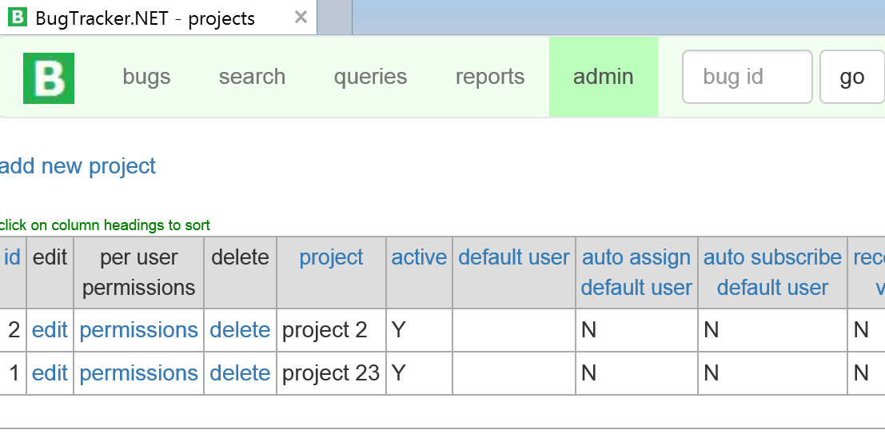
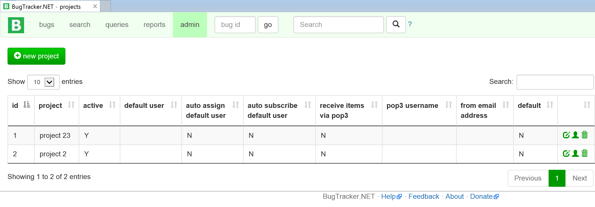

#Updating Data Grid Components

Most line of business ASP.NET applications rely heavily on some form of Data Table / Data Grid component. These components take either lists of strongly typed objects or an instance of a DataTable and display the contents in a tabular format. The grid components provide common functionality such as sorting, filtering and paging. While these components are intended to help the developer by encapsulating this common logic, they also tend to be a major road-block to updating the application. This happens because often the implementation of the grid component requires us to provide the data in a very specific way which leads to high coupling.

In the case of BugTracker, we are lucky in a way because it does not use a third party grid library. Unfortunately, the custom implementation of grids still makes it very difficult to change in some places.

##The Current Approach
Let's start with a very simple example from the Admin section. The Admin -> Projects page displays all of the projects defined in BugTracker in a simple, sortable grid.



From a user interface perspective, this grid is functional but a visually not very appealing. I would like to give it a more modern look and feel.

More importantly, there are a number of things I would like to improve regarding the implementation of this grid. Rendering this grid involves passing the Response object and a DataSet to a static method called `SortableHtmlTable.create_from_dataset`. This method contains a lot of code along the lines of:

```
r.Write("<tr>\n");

int db_column_count = 0;

foreach (DataColumn dc in ds.Tables[0].Columns)
{

    if ((edit_url != "" || delete_url != "")
    && db_column_count == (ds.Tables[0].Columns.Count - 1))
    {
        if (edit_url != "")
        {
            r.Write("<td class=datah valign=bottom>edit</td>");
        }
        if (delete_url != "")
        {
            r.Write("<td class=datah valign=bottom>delete</td>");
        }

    }
    else
    {

        // determine data type
        string datatype = "";
        if (Util.is_numeric_datatype(dc.DataType))
        {
            datatype = "num";
        }
        else if (dc.DataType == typeof(System.DateTime))
        {
            datatype = "date";
        }
        else
        {
            datatype = "str";
        }

        r.Write("<td class=datah valign=bottom>\n");

        if (dc.ColumnName.StartsWith("$no_sort_"))
        {
            r.Write(dc.ColumnName.Replace("$no_sort_", ""));
        }
        else
        {
            if (write_column_headings_as_links)
            {
                string sortlink = "<a href='javascript: sort_by_col($col, \"$type\")'>";
                sortlink = sortlink.Replace("$col", Convert.ToString(db_column_count));
                sortlink = sortlink.Replace("$type", datatype);
                r.Write(sortlink);
            }
            r.Write(dc.ColumnName);
            if (write_column_headings_as_links)
            {
                r.Write("</a>");
            }
        }

        //r.Write ("<br>"); // for debugging
        //r.Write (dc.DataType);

        r.Write("</td>\n");

    }

    db_column_count++;

}
r.Write("</tr>\n");
```
There are some big assumptions made in this code. If we want to disable sorting for a column, we need the column name to start with `$no_sort_`. The code above only represents the portion of the code that deals with rendering the header.  The code for rendering the rows of data is equally complex and also riddled with assumptions about the contents of the dataset.

In order of this mechanism of rendering a grid to work, the projects.aspx page executes some strange looking SQL:

```
ds = btnet.DbUtil.get_dataset(new SQLString(@"select
		pj_id [id],
		'<a href=edit_project.aspx?&id=' + convert(varchar,pj_id) + '>edit</a>' [$no_sort_edit],
		'<a href=edit_user_permissions2.aspx?projects=y&id=' + convert(varchar,pj_id) + '>permissions</a>' [$no_sort_per user<br>permissions],
		'<a href=delete_project.aspx?id=' + convert(varchar,pj_id) + '>delete</a>' [$no_sort_delete],
		pj_name [project],
		case when pj_active = 1 then 'Y' else 'N' end [active],
		us_username [default user],
		case when isnull(pj_auto_assign_default_user,0) = 1 then 'Y' else 'N' end [auto assign<br>default user],
		case when isnull(pj_auto_subscribe_default_user,0) = 1 then 'Y' else 'N' end [auto subscribe<br>default user],
		case when isnull(pj_enable_pop3,0) = 1 then 'Y' else 'N' end [receive items<br>via pop3],
		pj_pop3_username [pop3 username],
		pj_pop3_email_from [from email address],
		case when pj_default = 1 then 'Y' else 'N' end [default]
		from projects
		left outer join users on us_id = pj_default_user
		order by pj_name"));
```
Notice how there is HTML embedded inside this query. In order to have display edit/delete links, we need the cells in the data set to contain the actual HTML that will be rendered on the client.
This approach is difficult to maintain because the intention is not clear. User Interface concerns such as displaying links to other pages would be best managed by the aspx page. It is also inefficient. Instead of just retrieving the id from the database server, we are sending HTML to the database server in the form of a longer than necessary query, then asking it to send that HTML back for each row so the web server can send that HTML back to the client.

There is a ton of room for improvement here, but first let's start by finding an existing data grid control that we can use.

##Selecting a Grid Control
There are countless ASP.NET grid controls of various price and quality available. You can choose from a large set of server-side ASP.NET controls or an equally large set of client-side (JavaScript) controls. The choice of server-side vs. client-side controls will depend on a number of factors, including the experience of your team. Personally, I find the client-side controls to be easier to work with. Also, since we are working on an open source project here our budget for a control set is exactly $0. There tend to be more free options in the JavaScript world than in the ASP.NET world.

I have had very good luck with [DataTables](http://datatables.net/), a data table plug-in for jQuery. Note that this is not strictly an ASP.NET control. It is a client-side jQuery based control that can be used with any server-side web framework. It is a very capable, flexible, fast and extremely well document option for adding rich data grid functionality to any web application.

Let's start by adding DataTables to our project.

`Install-Package datatables.net`

Our intention here is to use this package on a large number of the existing BugTracker pages. It will be easiest if we reference the JavaScript and CSS files from our master page:

```
<link href="Content/DataTables-1.10.5/media/css/jquery.dataTables.min.css" rel="stylesheet" />
<script src="Scripts/DataTables-1.10.5/media/js/jquery.dataTables.min.js"></script>
```
[View the commit](https://github.com/dpaquette/BugTracker.NET/commit/769a4d286b90e927ffb67e811f35f3fb073d1826)

DataTables has a number of options of how to initialize the grid. For example, we can retrieve the data via Ajax or we can have the server render a simple HTML table then tell DataTables to convert that HTML table element into a fully featured data grid.

For the simple grids in BugTracker, we will opt for rendering the HTML table on the server. This option will fit nicely with the Layered approach that we discussed in the Styles of Web Forms section.

##Updating the Projects grid
Let's start by rendering the HTML table element in projects.aspx.

We will replace
```
<%
    if (ds.Tables[0].Rows.Count > 0)
    {
        SortableHtmlTable.create_from_dataset(
            Response, ds, "", "", false);
    }
    else
    {
        Response.Write("No projects in the database.");
    }
%>
```
with the following code that is a little more verbose but conveys the intention much more clearly:
```
  <table id="projects-table" class="table table-striped table-bordered" cellspacing="0" width="100%">
      <thead>
          <tr>
              <th>id</th>
              <th>project</th>
              <th>active</th>
              <th>default user</th>
              <th>auto assign<br/> default user</th>
              <th>auto subscribe<br/> default user</th>
              <th>receive items<br/> via pop3</th>
              <th>pop3 username</th>
              <th>from email<br/> address</th>
              <th>default</th>
              <th></th>
          </tr>
      </thead>
      <tbody>
          <% foreach (DataRow dataRow in ds.Tables[0].Rows)
             {
                 string projectId = Convert.ToString(dataRow["id"]);
                 %>
          <tr>
              <td><%=projectId %></td>
              <td><%=dataRow["project"] %></td>
              <td><%=dataRow["active"] %></td>
              <td><%=dataRow["default user"] %></td>
              <td><%=dataRow["auto assign default user"] %></td>
              <td><%=dataRow["auto subscribe default user"] %></td>
              <td><%=dataRow["receive items via pop3"] %></td>
              <td><%=dataRow["pop3 username"] %></td>
              <td><%=dataRow["from email address"] %></td>
              <td><%=dataRow["default"] %></td>
              <td>
                  <a href="edit_project.aspx?id=<%=projectId %>"><i class="glyphicon glyphicon-edit" title="Edit Project"></i></a>
                  <a href="edit_user_permissions2.aspx?projects=y&id=<%=projectId %>"><i class="glyphicon glyphicon-user" title="Edit User Permissions"></i></a>
                  <a href="delete_project.aspx?id=<%=projectId %>"><i class="glyphicon glyphicon-trash" title="Delete Project"></i></a>
              </td>

          </tr>
              <%} %>
      </tbody>
  </table>

```
Now that the Edit / Delete / User Permissions links are rendered clearly in the aspx page, we can simplify our SQL in the code behind.
```
ds = btnet.DbUtil.get_dataset(new SQLString(
                @"select
		pj_id [id],
		pj_name [project],
		case when pj_active = 1 then 'Y' else 'N' end [active],
		us_username [default user],
		case when isnull(pj_auto_assign_default_user,0) = 1 then 'Y' else 'N' end [auto assign default user],
		case when isnull(pj_auto_subscribe_default_user,0) = 1 then 'Y' else 'N' end [auto subscribe default user],
		case when isnull(pj_enable_pop3,0) = 1 then 'Y' else 'N' end [receive items via pop3],
		pj_pop3_username [pop3 username],
		pj_pop3_email_from [from email address],
		case when pj_default = 1 then 'Y' else 'N' end [default]
		from projects
		left outer join users on us_id = pj_default_user
		order by pj_name"));
```

In `projects.aspx` we can remove the reference to sortable.js, which contains JavaSCript code that was handling the sorting of the grid rendered by `SortableHtmlTable.create_from_dataset`. Finally, we need to add some JavaScript to initialize the data grid with the default options:
```
<script type="text/javascript">
    $(function() {
        $("#projects-table").dataTable();
    });
</script>
```
After applying some Bootstrap styling and layout, our new Projects grid looks like this:



We have moved the row actions for edit, user permissions and delete to the last column and changed them to more modern looking icons. By default, the DataTables component gives us column sorting with nice sort indicator icons. We also get Paging and Searching for free. While these feature might seem like overkill when the grid only has 2 rows, it will be nice to get these features across the board.

We now have a modern grid component that provides a better UI and we have greatly simplified the code related to displaying the grid.

[View the commit - Updated Projects grid](https://github.com/dpaquette/BugTracker.NET/commit/e73686ae788fef1fff08df4d824478fea5ddc4f0)

We can simplify this code even further by using the new Entity Framework model that we recently introduced. This eliminates the SQL in the code behind:

```
using (Context context = new Context())
{
    Projects = context.Projects.OrderBy(p => p.Name).ToArray();
}  
```
On the aspx page, we can now loop over the strongly typed array of `Project` objects which further simplifies the code:
```
 <% foreach (Project project in Projects)
     {
  %>
  <tr>
      <td><%=project.Id %></td>
      <td><%=project.Name%></td>
      <td><%=project.Active == 1 ? "Y" : "N" %></td>
      <!-- etc. -->
  </tr>
  <% } %>
```

[View the commit - Using Entity Framework in Projects page](https://github.com/dpaquette/BugTracker.NET/commit/11ffd198b329f10cb07f2eced5509a2121d24455)

#Performance
You might be wondering about the performance of this approach and how well it will scale when dealing with large amounts of data. These are valid concerns as this approach has the potential to be very inefficient if we are trying to display a large number of rows.

For the example above, performance should not be a problem. I can't imagine a situation where we would have more than a handful or projects in the system and I know that this approach will scale well to at least 100 rows. However, it is always a good idea to test these types of assumptions. I decided to create 1000 projects in the database and see how BugTracker handled it.

From a server performance, this seems to perform within acceptable parameters. The HTML that is generated comes in at just over 1MB. This is a little on the large side for sure, but by default IIS on my local developer machine is actually compressing that HTML before sending it to the client. The actual size of the package delivered to the client is only 73.8KB. I can live with these parameters as a worst case scenario.


One thing I did notice is that the grid flashes momentarily before the DataTables component is initialized. This can be annoying to the user. An easy solution to this is to hide the table initially, then show the table only after DataTables is done initializing.  While the table is initializing, we will show some *loading* text so the screen is not blank for the user.

```
...
  <div id="table-loading-indicator">Loading...</div>
  <table id="projects-table" class="table table-striped table-bordered" style="display: none">
...
<script type="text/javascript">
    $(function () {
        $("#projects-table").dataTable();
        $("#projects-table").show();
        $("#table-loading-indicator").hide();
    });
</script>
```

This small change will ensure a good user experience for a fairly large number of rows. We can be confident at least that all the admin grids will work using this approach.

[View the commit - Improved initialization of Projects grid](https://github.com/dpaquette/BugTracker.NET/commit/9d6287fe16fd73a32aff7a5abb96c2f3196c476c)

According to guidance provided on the [DataTables.net FAQ](http://datatables.net/faqs/index), this DOM sourced data approach should scale to ~5,000 rows. That seems a little high to me but again gives me confidence that we will be okay for the simple admin grid.

In the next post, we will turn our attention to the far more complex Bugs grid.
